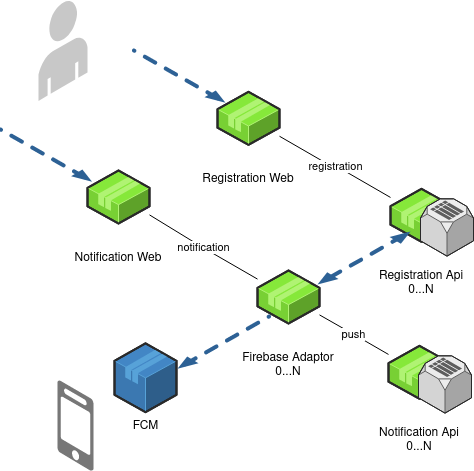

# Push-notification system based on Firebase Could Message. #

## Why I have to skip ##

* Octopus Deploy - I have not enough time to integrate it. I used docker-compose. 
* Error handling - my solution has async model of communication and error handling should look like extra statistic flow 
  to collect all result of action in separated DB. Not enough time to finish it. I made more logs.

## How to run it ##

### Deploy and launch ###

  !!! IN FIREBASE ADAPTER YOU HAVE TO USE [PERSONAL SECRET JSON](firebase-adapter/src/main/resources/options.json) !!!

  The solution uses a docker for deploy. For deploy and launch all microservices in correct way use command: 
  * `docker-compose -f docker-compose.yml up -d --build`
  
  When the process was finished check conditions of microservices:
  * `docker ps`
  You should get smth like that:

    CONTAINER ID   IMAGE                              COMMAND                  CREATED             STATUS             PORTS                                                                                  NAMES
    f87fad8b0d9b   net-services:statistic_web         "/bin/sh -c 'exec ja…"   6 minutes ago       Up 6 minutes       0.0.0.0:8140->8140/tcp, :::8140->8140/tcp                                              beline_statistic_web_1
    fa19537bc7df   net-services:registration_api      "/bin/sh -c 'exec ja…"   13 minutes ago      Up 13 minutes      0.0.0.0:8100->8100/tcp, :::8100->8100/tcp                                              beline_registration_api_1
    7be38cd6d6b1   net-services:firebase_adapter      "/bin/sh -c 'exec ja…"   About an hour ago   Up About an hour   0.0.0.0:8130->8130/tcp, :::8130->8130/tcp                                              beline_firebase_adapter_1
    3339eadcd79c   net-services:notify_api            "/bin/sh -c 'exec ja…"   About an hour ago   Up About an hour   0.0.0.0:8090->8090/tcp, :::8090->8090/tcp                                              beline_notify_api_1
    b47723f37667   net-services:registration_web      "/bin/sh -c 'exec ja…"   3 days ago          Up 3 days          0.0.0.0:8110->8110/tcp, :::8110->8110/tcp                                              beline_registration_web_1
    a485aa31e52f   net-services:notify_web            "/bin/sh -c 'exec ja…"   3 days ago          Up 3 days          0.0.0.0:8120->8120/tcp, :::8120->8120/tcp                                              beline_notify_web_1
    75c41d2b47ae   confluentinc/cp-kafka:latest       "/etc/confluent/dock…"   3 days ago          Up 3 days          9092/tcp, 0.0.0.0:29092->29092/tcp, :::29092->29092/tcp                                beline_kafka_1
    1a3f38973495   confluentinc/cp-zookeeper:latest   "/etc/confluent/dock…"   3 days ago          Up 3 days          2888/tcp, 3888/tcp, 0.0.0.0:22181->2181/tcp, :::22181->2181/tcp                        beline_zookeeper_1
    188df45b7a6a   postgres:12-alpine                 "docker-entrypoint.s…"   3 days ago          Up 3 days          54321/tcp, 0.0.0.0:54321->5432/tcp, :::54321->5432/tcp                                 registration_db
    6ae92c302f2e   postgres:12-alpine                 "docker-entrypoint.s…"   3 days ago          Up 3 days          0.0.0.0:54320->5432/tcp, :::54320->5432/tcp                                            notify_db
    95035778ba7f   portainer/portainer                "/portainer"             3 days ago          Up 3 days          0.0.0.0:8000->8000/tcp, :::8000->8000/tcp, 0.0.0.0:9000->9000/tcp, :::9000->9000/tcp   portainer

### Testing ###

  To test rest api you may use postman [collection](./postman) for Postman. Also you can use 
  [link](http://localhost:8140/) to see statistic (but first you should fill up the system by data).

---

## Description of solution ##

### 1 Registration ###

---
     [agent]  [registration-web]  [notify-web]  [firebase-adapter]     [notify-api]  [registration-api]
        |            |               |              [0...N]              [0...N]         [0...N]
        |            |               |                 |                    |               |
        #-----1.0--->#               |                 |                    |               |
        |          (1.1)             |                 |                    |               |
        |            #----------------------------------------1.2-------------------------->#
        |            |               |                 |                    |             (1.3)
        |            |               |                 |                    |               |
     [agent]  [registration-web]  [notify-web]  [firebase-adapter]     [notify-api]  [registration-api]
---

- 1.0 Web request to web service [registration-web] by JSON with a data about the registration.
- 1.1 Web service [registration-web] validates and balances web requests, send it to kafka.
- 1.2 Kafka plays a role of load balancer by sending messages to different partitions.
    * Algorithm based on phone number of user `phoneNumber / numberOfPartitions = N`. Its makes data synchronisation easier.

### 2 Notification ###

---

     [agent]  [registration-web]  [notify-web]  [firebase-adapter]     [notify-api]  [registration-api]
        |            |               |              [0...N]              [0...N]         [0...N]
        #--------------2.0---------->#                 |                    |               |
        |            |              2.1                |                    |               |
        |            |               #-------2.2------>#                    |               |
        |            |               |                2.3                   |               |
        |            |               |                 #---------------2.4----------------->#
        |            |               |                 |                    |              2.5
        |            |               |                 #<--------------2.6------------------#
        |            |               |                2.7                   |               |
        |            |               |                 #--2.8-->[FCM]       |               |
        |            |               |                2.9                   |               |
        |            |               |                 #--------2.10------->#               |
        |            |               |                 |                    |               |

---

- 2.0 Web request to web service [notify-web] by JSON with notification and phone numbers of recipients.
- 2.1 Web service [notify-web] validates and balances web requests, send it to kafka. If request has set of phones, 
  [notify-web] converts it to one kafka message for each phone.
- 2.2 Kafka plays a role of load balancer by sending messages to different partitions.
    * Algorithm based on phone number of user `phoneNumber / numberOfPartitions = N`. Its makes data synchronisation 
      easier.
- 2.3 Web service [firebase-adapter] listens a partition of kafka topic.
- 2.4 The service gets a notification dto and makes web request to [registration-api] to approve of registration for thr 
  request. 
- 2.5 The [registration-api] gets data of registration from data source.
- 2.6 The [registration-api] responses to [firebase-adapter] by JSON with all tokens registered for particular phone 
  number.
- 2.7 The [firebase-adapter] gets all tokens.
- 2.8 The [firebase-adapter] gets all tokens and sends kafka notification for each of it to [FCM].
- 2.9 If [firebase-adapter] successful send notification to [FCM] it resents a notification to next kafka topic.
- 2.10 The [notify-api] receives notification and saves it to database.  

---

### 3 DTOs ###

 * JSON for [registration-web]:

        {
            "token" : "asd32r3ff34f45g56h5ht7",
            "phone" : 375331234567,
            "appVersion": "android"
        }

 * JSON for [notify-web]:

        {
            "title" : "we announce the thing",
            "text" : "text which describes the thing",
            "sendTime" : 10101010101,
            "phones":
            [
                375331234567,
                375331234568,
                375331234569,
            ]
        }
